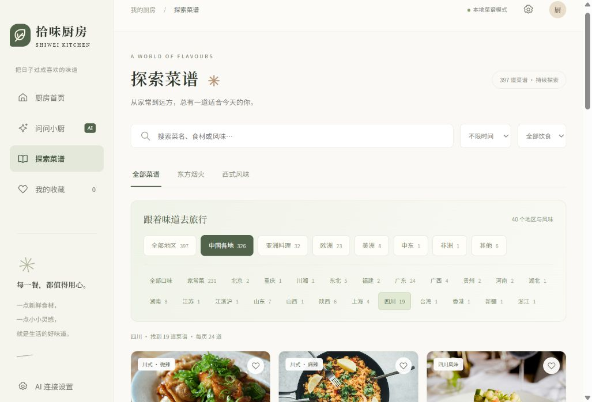

# 拾味厨房

一个在本机浏览器中使用的做饭助手。前端为暖白与橄榄绿风格，后端使用 Python 标准库和 SQLite，不需要安装 npm 或 pip 依赖。



## 开始使用

需要 Python 3.10 或更新版本（本项目已使用 Python 3.12 验证）。

双击 **启动厨房.bat**。脚本会检测可用的 Python 3.10+；当前电脑优先使用已验证的 `E:\railway\python.exe`，否则检查 PATH 与 `py` 启动器。启动失败时窗口会保留具体错误。

也可在本目录执行：

```powershell
python app.py --open
```

浏览器访问 **http://127.0.0.1:8765**。终端需要保持运行；按 `Ctrl+C` 停止。

如端口被占用：

```powershell
python app.py --port 8766 --open
```

## 接入 DeepSeek

打开网页左下角 **AI 连接设置**，填写自己的 API Key 和模型名称，然后保存。默认使用 `deepseek-flash`，也可填写账户支持的其他模型。配置保存到本目录 `.env`；Key 不写入前端代码，也不会通过 API 返回浏览器。

也可复制 `.env.example` 为 `.env` 后填写，再启动服务。文件配置优先于同名系统环境变量。不要共享 `.env`。

DeepSeek 通过后端 HTTPS 请求 `/chat/completions`，支持 `search_recipes` 和 `get_recipe` 两个工具。服务先从 SQLite 检索相关菜谱，再允许模型追加查询，根据人数、时间、食材、忌口和设备给出中文做法。一次回答最多 4 轮模型请求。问答时，会向 DeepSeek 发送相关菜谱、最近 12 条对话和当前厨房条件。网站不执行任意模型代码或任意 SQL。

**未填写 Key：** 可以搜索、筛选、收藏、查看菜谱、换算食材用量，并获得明确标注的本地菜谱检索回答。此模式不具备 AI 推理或自动替换能力。

**填写 Key 后：** 提问会使用账户的 API 额度。配置状态表示 Key 已保存，不代表已验证有效；首次提问将验证连接。无效 Key、余额不足、限流和网络超时都会显示对应错误，不会伪造 AI 回答。

接口依据 [DeepSeek 首次调用文档](https://api-docs.deepseek.com/) 和 [Tool Calls 文档](https://api-docs.deepseek.com/guides/tool_calls/) 实现。默认关闭思考模式以简化多轮工具调用。

## 菜谱与数据库

目前内置 **397 条菜谱做法**：17 道精选家庭菜谱、372 道 HowToCook 社区菜谱、8 道 Bastian/recipes 中文整理版。不同来源的同名菜保留为不同做法。按 **40 个地区与风味** 分类，可先选中国、亚洲、欧洲、美洲、中东、非洲，再筛选四川、广东、日本、意大利、墨西哥等具体地区（无法明确西式地域的做法归入“其他”）；每页显示24道。地区是浏览标签，出处不明确或涉及多个地区的中式菜归为家常菜。详细数量见 [data/地区分类.md](data/地区分类.md)。

原始种子数据：`data/recipes.json`。首次启动自动建立 `data/kitchen.db`；升级启动时自动导入有变更的内置数据，更新地区字段，包含 `recipes`、`ingredients`、`steps`、`sources`、`favorites`、`sessions` 和 `messages` 表。收藏和问答历史在重启后保留。厨房偏好另保存在浏览器本地存储中。

新增社区菜谱保留食材、原文用量说明和操作小节，不将不明确的份数自动换算。原文用时会标注“约”；没有总用时的条目显示“用时未标注”，不参与限时筛选。新增条目的饮食类型为待核对，不参与素食筛选。常见过敏原通过食材关键词补充标注，复合调料仍需核对包装。社区内容未经逐条试做。来源、许可与配图说明见 [SOURCES.md](SOURCES.md)。

要添加更多菜谱，参照 `data/recipes.json` 的字段格式，整理公开来源并保存 JSON 数组，然后运行：

```powershell
python app.py --import-recipes data/recipes.json
```

导入会先校验所有记录，以 `id` 更新菜谱，并保留既有收藏和聊天；不会删除导入文件中未出现的菜谱。图片必须是 `public/assets/` 内已经存在的本地资源。`scripts/build_seed.py` 可重新生成精选 JSON；内置 JSON 的内容变化会在下次启动时导入。

社区快照可以完全离线重建，不需要安装第三方依赖：

```powershell
python scripts/build_western.py
python scripts/expand_recipes.py
```

如需重新获取固定版本的 GitHub Markdown，使用 `python scripts/expand_recipes.py --fetch`。只下载文字，不下载上游图片、不执行上游脚本。版本、校验摘要及排除项保存在 `data/recipe-sources.json`，原始文字及许可在 `data/upstream/`。重启服务后会自动导入。

DeepSeek 的 `search_recipes` 工具和 `/api/recipes` 接口都支持 `area_group`、`area` 参数。问“川菜怎么做”也会识别地区。

## 项目结构

```text
拾味厨房/
├── app.py                 本地服务器、数据库、DeepSeek 工具调用
├── 启动厨房.bat           双击启动并打开浏览器
├── .env.example           Key 配置示例
├── public/
│   ├── index.html         首页、菜谱、收藏、问答和设置
│   ├── style.css          响应式布局与视觉样式
│   ├── app.js             前端交互
│   └── assets/            本地配图与品牌图标
├── data/
│   ├── recipes.json       带来源的菜谱种子
│   ├── community-recipes.json  380条开源社区菜谱
│   ├── recipe-sources.json     固定版本与校验摘要
│   ├── 地区分类.md             地区数量统计
│   ├── upstream/               开源 Markdown 快照与许可
│   └── kitchen.db              SQLite 数据库（运行生成）
├── scripts/
│   ├── build_seed.py       生成首批菜谱 JSON
│   └── fetch_assets.py     获取 Unsplash 配图
├── tests/test_app.py      接口、检索、持久化及工具调用测试
└── SOURCES.md             菜谱参考、模型文档、图片来源
```

## 验证与使用范围

运行：

```powershell
python -m unittest discover -s tests -v
node --check public/app.js
```

Python 测试使用临时数据库和配置文件，模拟 DeepSeek 响应，不向真实 DeepSeek 发送数据或消耗额度。Node 只用于可选的 JavaScript 语法检查，网站运行不依赖 Node。

服务只绑定 `127.0.0.1`，适用于个人电脑上的本地使用。请求验证 Host 和 Origin，静态文件限制在 `public/`，`.env` 与数据库不能从网页下载。当前无多人账号、云部署或实时联网搜索功能。过敏原标签是辅助筛选；复合调味料仍须核对包装。
